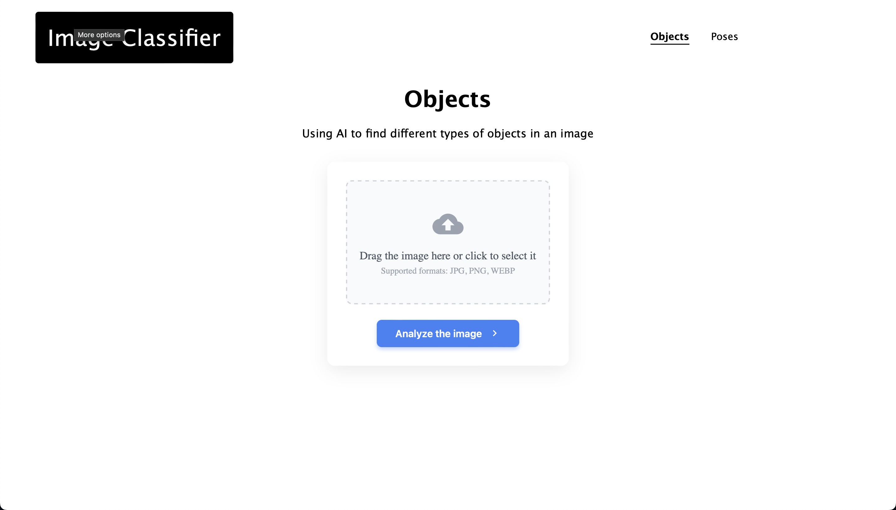

<h1 align="center">🌌 Image Classifier & Object Detector</h1>

<p align="center">
  
</p>


<div align="center">

[](https://www.python.org/downloads/)
[](https://pytorch.org/)
[](https://www.docker.com/)

</div>


The first project in the study of machine learning: classification of objects in images with definition of boundaries.

## 💡 Project idea
The user uploads a photo → The system:
1. Identifies objects (dog/cat/car/...)
2. Draws a bounding box around each object
3. Returns JSON with coordinates of recognized objects

## ⚙️ Technology stack
### **Backend**
- Python 3.12
- PyTorch
- FastAPI (REST API)
- Uvicorn (ASGI-server)

### **Frontend**
- HTML5 + CSS + JavaScript (simple loading interface)

### **Infrastructure**
- Docker (containerization)

## 🚀 Quick start

### 💻 Local installation
```bash
# Clone a repository
git clone https://github.com/temm-dev/image-classifier.git
cd image-classifier

# Install dependencies
poetry install
# OR
pip install -r requirements.txt

# Launch the app
cd src/app
uvicorn main:app --reload --port 8000
```

### 🐳 Via Docker
#### Use a ready-made image
```bash
docker pull temmdev/image-classifier
docker run --name image-classifier -p 8000:8000 -d temmdev/image-classifier
```


#### Assemble the image yourself
```bash
docker build -t my-image-classifier .
docker run --name my-classifier -p 8000:8000 -d my-image-classifier
```

<br>

> **Have a nice day!** 🍀